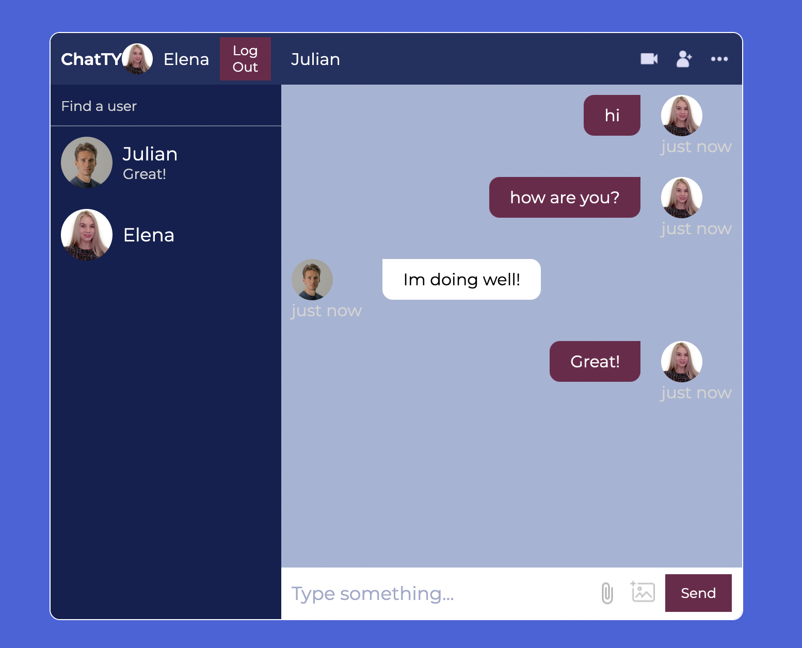

## ChaptTY

ChaptTY is realtime private chat application

## Installation

- Clone the repo
- Run `npm install` to install dependencies
- Install firebase cli `npm install -g firebase-tools`
- Login to firebase `firebase login`
- Copy `.env.example` to `.env` and fill in the required fields
- Run `npm run dev` to start the app in development mode

Runs the app in the development mode.\
Open [http://localhost:5173](http://localhost:5173) to view it in your browser.

